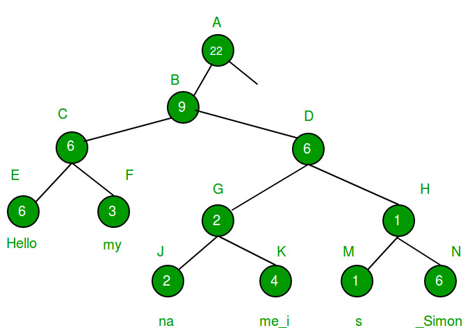

# ESTRUCTURAS DE DATOS PARA GUARDAR EL TEXTO
Estos son algunos tipos de estructuras de datos que se pueden usar en un editor de texto.
Los iré nombrando de peor a mejor y explicaré su funcionamiento básico. Esto está basado
en la información sacada de [este foro,](https://www.averylaird.com/programming/the%20text%20editor/2017/09/30/the-piece-table)
aunque la explicación la sacaré de varias páginas distinas y lo resumiré un poco a mi manera.


## Array

No hace falta explicar lo que es un array creo yo, pero es la peor opción ya que
tienes que cargar todo el fichero en el array, y en cada inserción o borrado tienes 
que mover todos los elementos del array, lo quitamos como opción viable.

## Rope



Una rope o soga (la traducción más correcta es cuerda porque es rope o cord pero bueno)
es un tipo de arbol binario donde cada nodo hoja contiene un string y su peso 
(el tamaño del string). Los nodos internos contienen la suma de los pesos de todos
los nodos hoja en el subarbol izquierdo. Básicamente cada nodo interno divide
a la mitad el string y peso de ese nodo es la primera mitad.

Tiene dos operaciones principales si pensamos en añadir o borrar caracteres de un texto:
- Split: divide un string en dos en un indice concreto.
- Concat: concatena dos strings en uno.

Para insertar haces un split donde quieres insertar el contenido y concatenas dos veces.<br>
Para borrar divides dos veces el string y los vuelves a concatenar sin incluir lo que 
quieres borrar.

## Gap Buffer

El gap buffer es un array dinámico que permite inserción y borrado eficiente siempre
que sea cerca de la misma localización. Esto es muy util en un editor de texto ya que
la gran mayoría de cambios se realizan cerca del cursor.<br>
El texto se almacena en un buffer (un array de caracteres), en dos segmentos contínuos,
con un hueco en el medio. Cuando mueves el cursor, se copia texto de un segmeto
al otro. Lo que hay dentro del segmento no se tiene en cuenta, lo que ayuda con el borrado.
Normalmente se mantiene el tamaño del hueco usando punteros o indices de array.
- Insertar: El hueco tiene un tamaño concreto. Copiamos en ahi el texto insertado, y si lo 
excede se expande el hueco. Esto se añade al final del primer segmento.
- Borrar: Movemos el puntero o indice del hueco para que incluya el contenido borrado.

#### Representación:
```
Se vería algo[             ] así.
Se vería algo insertado [  ] así.
Se vería algo insertado excediendo gap[             ] así.
Se vería algo[ borrado     ] así.
```
Esto puede parecer raro, ya que puede parecer poco ineficiente y dificil de entender 
del todo como funciona el hueco, pero normalmente es más eficiente que rope,
y de hecho emacs usa este método, el truco es que compensa su velocidad con la mayoría
de inserciones y borrados a pesar de tener ciertos casos muy poco comunes donde este
método es bastante ineficiente.

## Piece table

Este puede ser confuso pero la idea es interesante, una piece table (o tabla de piezas)
tiene dos buffers, el primero, llamado _**file buffer**_, tiene el contenido del fichero original,
es de tamaño fijo y read-only, lo que hace más facil añadir un deshacer cambios ilimitado
El segundo, llamado _**add buffer**_, tiene el contenido añadido al fichero,
es de tamaño variable y append-only. (Voy a llamarlos archivo original y nuevo respectivamente)

Tenemos una tabla con tres columnas, file, start y length.
- En file se indica si vamos a usar el archivo original o el nuevo.
- En start se indica el offset donde empieza el segmento en cada archivo (antes de editarlo)
- En length se indica el tamaño del segmento.

Al principio solo hay una fila que apunta al archivo original entero.
Para borrar se divide la fila en dos partes, una que apunta hasta antes de la parte borrada
y otra que apunta a lo que hay despues de la parte borrada.

Para insertar se divide en tres partes, la primera apunta al fichero original hasta antes
de la parte donde se inserta, la segunda apunta a la parte del fichero nuevo que corresponde
con el texto añadido, y la tercera apunta al fichero original despues de la parte insertada.

Hay algunos casos donde esto puede variar, como al insertar o borrar al principio y final del
archivo, además si se insertan varias piezas seguidas una de otra se pueden unir en una 
pieza más grande, para eliminar filas en la tabla. Los archivos de tamaño 0 se suelen eliminar.


